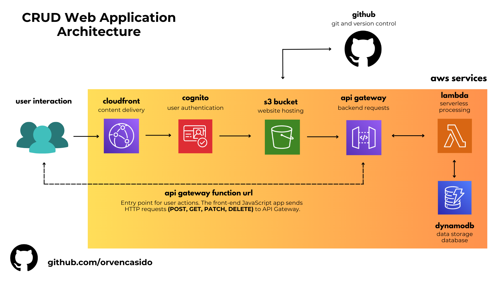

# CRUD Web Application
Live Preview: <a href="https://d26chwpjybvo1s.cloudfront.net/">CRUD Web Application</a>

This project is a serverless CRUD web application that allows users to add, edit, delete, and view tasks. It demonstrates the integration of front-end and back-end services using AWS technologies. Below is the architecture of the application:

## System Architecture

## Technology Used

Front-end: HTML, JavaScript
Back-end: AWS Lambda, API Gateway, DynamoDB
Hosting: AWS S3, AWS CloudFront
Authentication: AWS Cognito
Version Control: Git, GitHub

## 🔗 Developer Links

# CRUD Web Application Documentation

### Project Overview
The project showcases the cloud skills through the CRUD Web Application.

## Creating the HTML Website
### Creating the HTML Website
I began by creating an HTML website. 

2024 | Orven Casido

